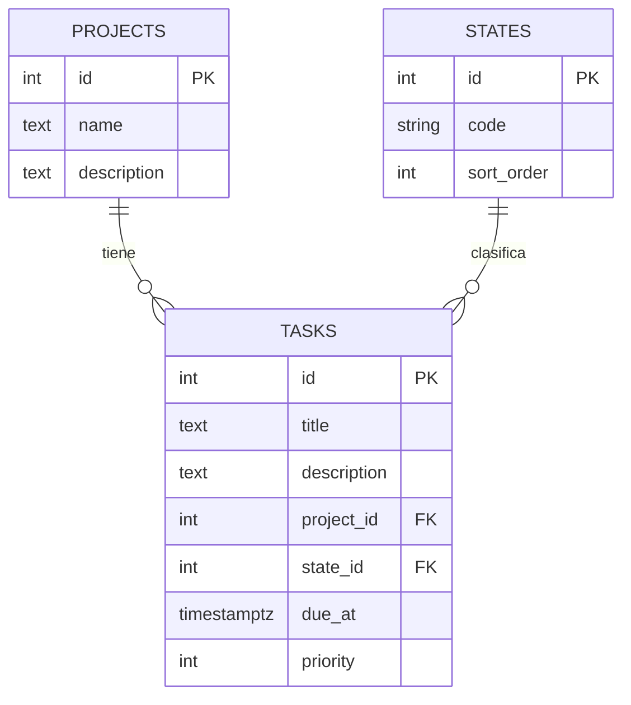

# Esquema de la base de datos

Reconstruido leyendo `alembic/versions/` en orden (`65c1e1fe2aac` →
`f84889a78c54` → `bf89f20664d1` → `e70c34e05f8a` → `9f8fc63aaa14`). Muestra
el estado final de cada tabla tras aplicar todas las migraciones, no el
contenido de una migración aislada. El comportamiento observable de la API
está en [contrato-api.md](contrato-api.md); este documento no lo repite.

## Diagrama

No incluye `alembic_version`: es la tabla de control de Alembic, ajena al
dominio.

## Diccionario de datos

| Tabla | Columna | Tipo | Nulable | Significado |
|---|---|---|---|---|
| states | id | integer | No | |
| states | code | varchar(32) | No | Único. Catálogo y orden descritos en [contrato-api.md#estados](contrato-api.md#estados). La unicidad es lo que permite que el seed sea idempotente (`ON CONFLICT (code) DO NOTHING`, en `f84889a78c54_seed_states_catalog.py`). |
| states | sort_order | integer | No | Único. Es "el campo de orden del catálogo" de [contrato-api.md#orden-de-las-listas](contrato-api.md#orden-de-las-listas); valores fijados por el seed: `PENDIENTE=1, EN_CURSO=2, BLOQUEADA=3, HECHA=4`. |
| projects | id | integer | No | |
| projects | name | text | No | |
| projects | description | text | Sí | |
| tasks | id | integer | No | |
| tasks | title | text | No | Normalización descrita en [contrato-api.md#normalización-de-texto](contrato-api.md#normalización-de-texto). |
| tasks | description | text | Sí | |
| tasks | project_id | integer, FK → projects.id | No | Sin `ondelete` declarado: Postgres impide borrar un proyecto referenciado por una tarea, por debajo del `409` aplicativo de [contrato-api.md#proyectos](contrato-api.md#proyectos). |
| tasks | state_id | integer, FK → states.id | No | Sin `ondelete` declarado, igual que `project_id`. Como no hay endpoint para borrar estados, esta restricción nunca se ejerce en la práctica. |
| tasks | due_at | timestamptz | Sí | Zona horaria, normalización a UTC y formato de serialización descritos en [contrato-api.md#tareas-v2-fechas-límite](contrato-api.md#tareas-v2-fechas-límite). |
| tasks | priority | integer | Sí | Semántica en [contrato-api.md#tareas-v3-prioridad](contrato-api.md#tareas-v3-prioridad). Se agregó en una migración (`9f8fc63aaa14`) posterior a la que crea `tasks` (`e70c34e05f8a`): toda fila creada antes de esa migración quedó con `priority = NULL` automáticamente. |
